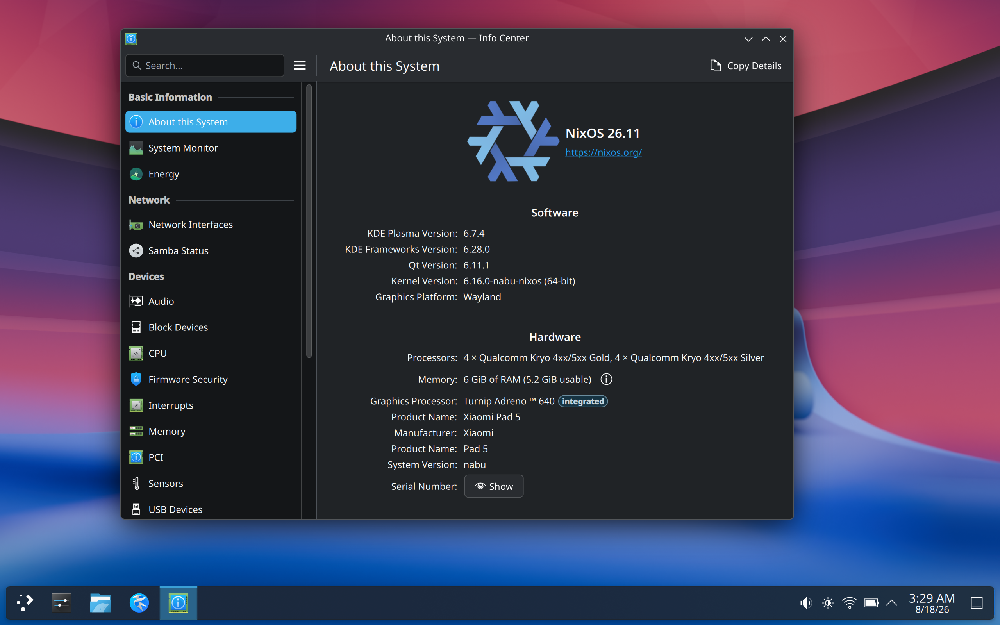

# Nabu NixOS Images

> [!NOTE]
> This project is **not** actively maintained. Feel free to use it as a template.

NixOS on Xiaomi Pad 5 (nabu).



## Installation

> [!NOTE]
> If the partitions are corrupted, reflash the original system first.
> See <https://pocketblue.github.io/devices/xiaomi-nabu/#uninstall-fedora-and-get-stock-rom-back>

Requirements:

- TWRP: <https://github.com/ArKT-7/twrp_device_xiaomi_nabu/releases/tag/mod_linux>
- Installer: <https://github.com/scorpiofifth/nabu-nixos-images/releases/tag/installer>
- DualBoot UEFI: <https://github.com/rodriguezst/nabu-dualboot-img/releases>

Steps:

1. Reboot into bootloader and run `fastboot boot <twrp>`.
2. In TWRP, open the shell and run the `partition` command.
3. Reboot into bootloader and run the setup command again.
4. Flash the `Installer`.
5. Flash `DualBoot UEFI`.

See <https://github.com/pocketblue/dualboot/blob/main/docs/xiaomi-nabu.md> for more details.

## After installation

You should generate `hardware-configuration.nix` by running `nixos-generate-config`, which uses UUIDs instead of partition labels.

> [!NOTE]
> Prefer `sudo nixos-rebuild boot` over `switch`, since the latter may break some services.
> You also need to build the UKI file and copy it to the ESP for the changes to take effect:
>
> ```bash
> nix build ~/NixOS#nixosConfigurations.XiaomiNabu.config.system.build.uki
> sudo cp result/nixos.efi /boot/EFI/nixos
> ```

## Known issues

This project aims to match Kumar-Jy's Arch Linux ARM image, but the following are not yet complete:

- Battery is detected but cannot be charged.
- Bluetooth sometimes doesn't work when rebooting.
- Low desktop performance (possibly caused by NixOS itself).

Pull requests are welcome!

## Helpful Information

### Reassemble the Split Image

Due to GitHub's 2 GB release file size limit, the built image is split into multiple parts. Here is how to reassemble it:

1. Download all `zip.**` files from the release.
2. Place all parts into an empty folder.
3. Run `cat *.zip.* > output.zip` to merge them into one zip.

> [!NOTE]
> Verify the result with `7z t output.zip`.

### Build Your Own Image

Use the template feature on GitHub to create your own repo. Go to the repo's **Settings** > **Actions** > **Workflow permissions**, and set it to "Read and write permissions".

Then go to the **Actions** page and trigger the workflow manually.

After a while, the result will appear on the **Releases** page. To further customize this repo, adjust the files in `nixos/`.

> [!NOTE]
> For the default image configuration, see the `flake.nix` and `nixos/` directory in this repo.
> For basic hardware configuration, also see <https://github.com/scorpiofifth/xiaomi-nabu-flake/>, which is important if you want to rebuild your own NixOS.

## Acknowledgements

- This project was mostly inspired by <https://github.com/Kumar-Jy>.
- Most of the foundational files come from <https://github.com/rodriguezst>.
- Thanks to all the contributors of packages such as the kernel, firmware, and audio configuration.
